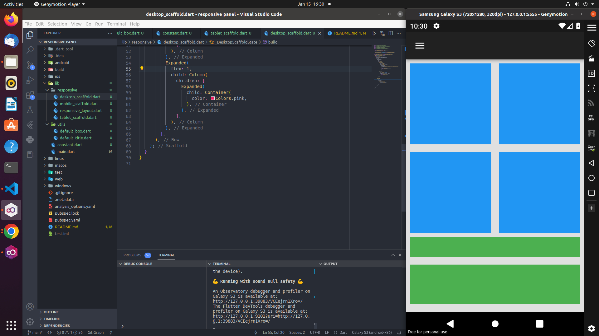

# Responsive box

Create a project that displays well on mobile, tablet and desktop screens. For this project we will use the `flutter` framework with the `LayoutBuilder` widget.

[See project ☝️](https://github.com/DelRoos/responsive_panel.git)

## Getting Started 🤔

Clone the project

```
git clone https://github.com/DelRoos/responsive_panel.git
```

Launch the project on the web

```
flutter run -d chrome
```

Launch the project on mobile devices

```
flutter run
```

## Explanation 👨‍💻

In this project we are interested in 3 types of devices:

* Mobile **( < 500)**
* Tablet **(in [500, 1100])**
* Desktop **( > 1100  )**

To achieve this, we will use the `LayoutBuilder` Widget to specify to put constraints on the screen width to detect the devices

```

    return LayoutBuilder(builder: (context, constraint) {
      if (constraint.maxWidth < 500) {
        return mobileScaffold;
      } else if (constraint.maxWidth < 1100) {
        return tabletScaffold;
      } else {
        return desktopScaffold;
      }
    });
```

## Result ✅


